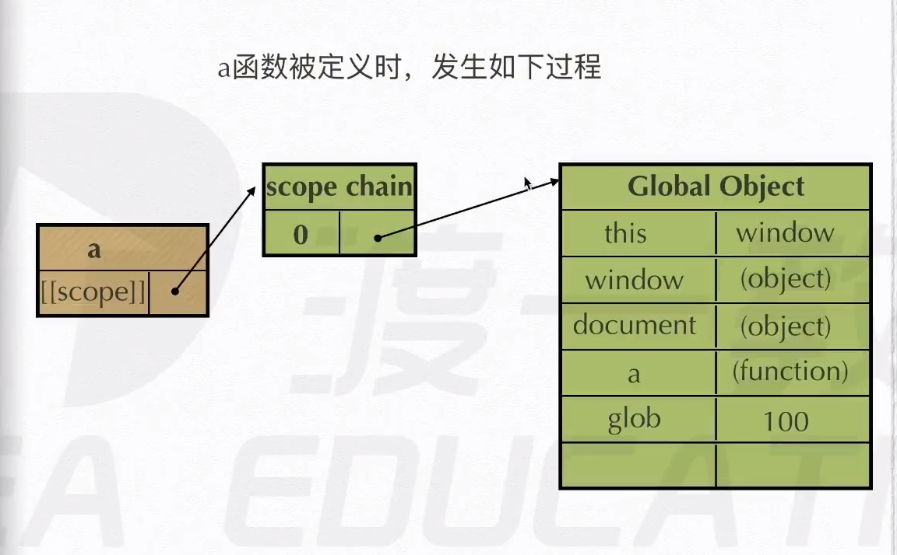
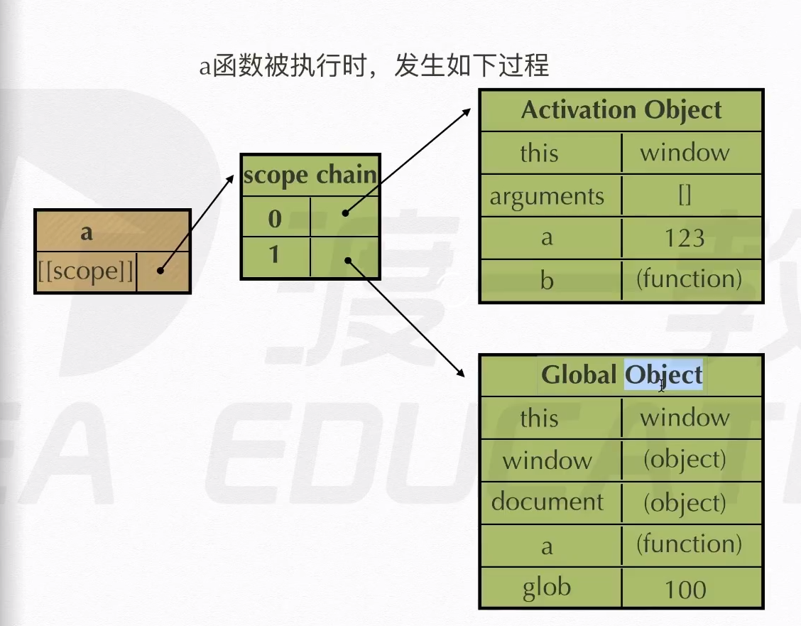
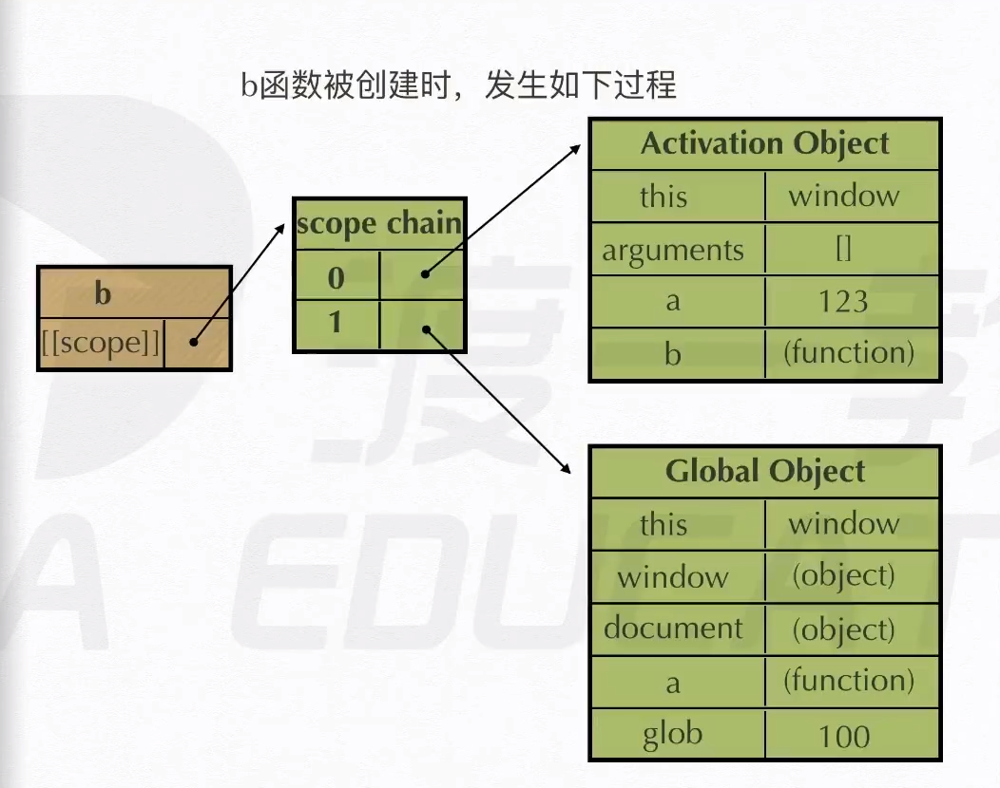
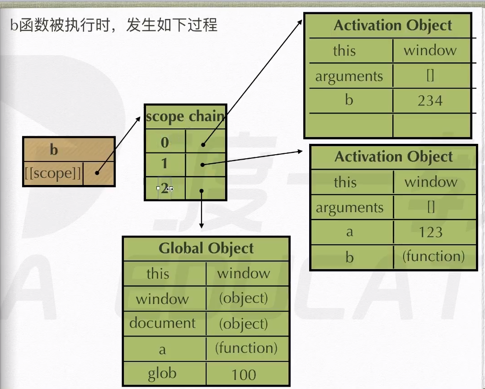

## 函数作用域

### 执行期上下文：

> 当函数在执行是，会产生一个称为`执行期上下文`的内部对象（活动对象--AO（`Activation Object`））。一个执行期上下文定一个了一个函数执行时的运行环境，函数每次执行是的执行上下文都是独一无二的，函数执行完毕是，执行上下文会被销毁。

### 作用域

> [[scope]]指的就是我们常说的作用域，其中储存了运行期上下文的集合

### 全局作用域

> 全局作用域在页面打开时创建，页面关闭时销毁
>
> - 全局变量：
>
>   生命周期存在于整个程序
>
>   能够别程序中的任何方法或者函数访问
>
>   - 全局变量的声明
>
>         - 在函数外部使用 `var` 关键字
>
>         * 直接将变量挂载到 `window` 对象上
>
>         - 不使用`声明关键字`，会默认成为全局变量

**大量的使用全局变量会造成命名空间污染**

### 函数作用域

> 函数作用域内，对外是封闭的，外部无法直接访问函数内部的变量和方法
>
> - 外界访问函数内部的变量和方法
>
>   - 通过 `return` 语句将变量返回到外界
>
>   * 通过闭包

### 块级作用域

> 在 es5 及之前的 es 版本中是不存在块级作用域的概念的，要形成块级作用域需要使用 `let`或者 `const` 声明关键字

一般来说，块级作用域的访问是在 {} 内部

例如在 `for`中块级作用域

```javascript
// 使用 var 关键字声明的变量没有块级作用域，因此在 for 循环结束之后还能沟访问变量 i
for (var i = 0; i < 10; i++) {
  //.....
}
console.log(i); // 10

// 使用 let 和 const 声明的变量在 for 循环结束之后不能在访问
for (let j = 0; j < 10; j++) {
  //...
}
console.log(j); // 报错：ReferenceError: j is not defined
```

#### 使用块级作用域解决问题

```javascript
for (var i = 0; i < 5; i++) {
  setTimeOut(() => {
    console.log(i); // 5 5 5 5 5
  }, 1000);
}
```

上面的例子中，在回调函数执行之前，`i` 的值已经自增到了 5，因此输出为 5 个 5

##### 使用 let 创建块级作用域

```javascript
for (let i = 0; i < 5; i++) {
  setTimeOut(() => {
    console.log(i); // 0 1 2 3 4
  }, 1000);
}
```

### 作用域链

> [[scope]]中所储存的执行期上下文对象的集合，这个集合成链式链接，因此成为作用域链

**查找变量的时候从作用域链的顶端向下寻找**

```javascript
function a() {
  function b() {
    var b = 123;
  }
  var a = 234;
  b();
}
var glob = 100;
a();
```

**上述代码在执行过程中作用域链的变化过程**

- a 函数被创建时



- a 函数被执行时



- b 函数被创建时

**由于 b 函数是在 a 函数内部定义的，因此 在 b 函数被创建时会直接继承 a 函数已经存在的作用域链**



- b 函数被执行时


