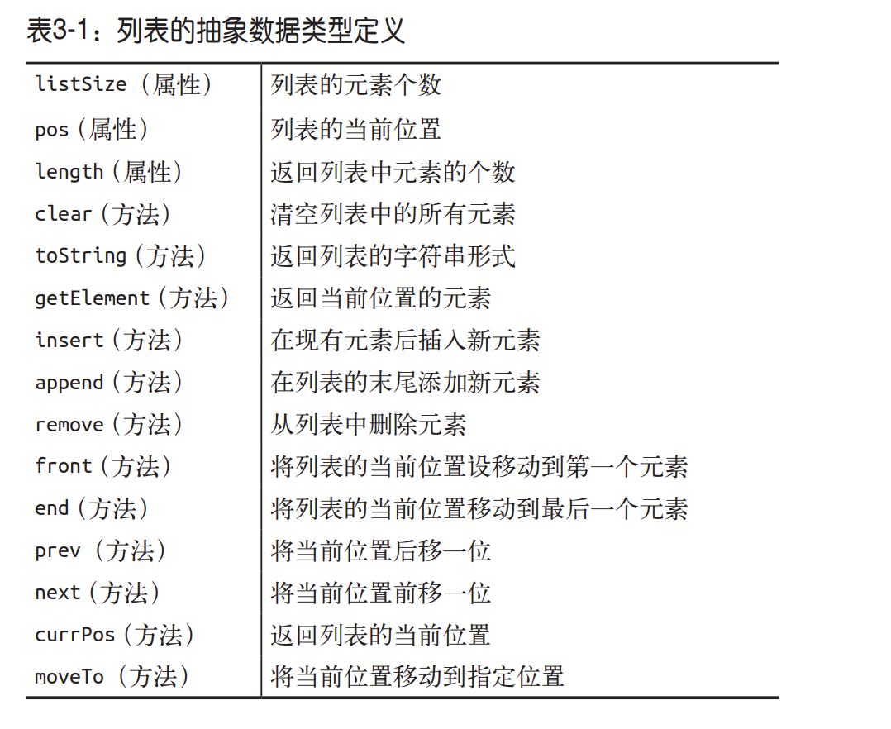

## 列表

> 列表是一组有序的数据。每个列表中的数据项称为元素

### 列表的抽象数据类型定义

下图列出了列表所具有的属性和方法



### 实现列表类

根据上面的列表抽象数据类型，实现一个 List 类；

```javascript
/**
 * 实现一个 列表类
 */

function List() {
  this.listSize = 0;
  this.pos = 0;
  this.dataStore = []; // 初始化一个数组来保存列表元素
  this.clear = clear;
  this.toString = toString;
  this.insert = insert;
  this.append = append;
  this.remove = remove;
  this.front = front;
  this.end = end;
  this.prev = prev;
  this.next = next;
  this.currPos = currPos;
  this.moveTo = moveTo;
  this.getElement = getElement;
  this.length = length;
  this.contains = contains;

  function append(element) {
    this.dataStore[this.listSize++] = element;
  }
  function remove(el) {
    let index = this.find(el);
    if (index > -1) {
      this.dataStore.splice(index, 1);
      this.listSize--;
      return true;
    }
    return false;
  }
  function find(el) {
    return this.dataStore.indoxOf(el);
  }
  function length() {
    return this.listSize;
  }
  function clear() {
    delete this.dataStore;
    this.dataStore = [];
    this.listSize = 0;
    this.pos = 0;
  }
  function toString() {
    return this.dataStore;
  }
  function insert(el, val) {
    let index = this.find(el);
    if (index > -1) {
      this.dataStore.splice(index, 0, val);
      this.listSize++;
      return true;
    }
    return false;
  }
  function front() {
    this.pos = 0;
  }
  function end() {
    this.pos = tihs.listSize - 1;
  }
  function prev() {
    if (this.pos > 0) {
      this.pos--;
    }
  }
  function next() {
    if (this.pos < this.listSize) {
      this.pos++;
    }
  }
  function currPos() {
    return tihs.pos;
  }
  function moveTo(num) {
    if ((typeof num).toLowerCase === "number") {
      this.pos = num;
    }
  }
  function contains(el) {
    for (let i = 0; i < this.dataStore.length; i++) {
      if (this.dataStore[i] === el) {
        return true;
      }
    }
    return false;
  }

  function getElement() {
    return this.dataStore[this.pos];
  }
}
```
