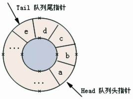

## 队列

> 队列是遵循先进先出原则的一组有序的项

```javascript
class Queue {
  constructor() {
    this.count = 0;
    this.lowestCount = 0;
    this.items = {};
  }
  enqueue(item) {
    this.items[this.count++] = item;
  }
  dequeue() {
    if (this.isEmpty()) {
      return undefined;
    }
    const result = this.items[this.lowestCount];
    delete this.items[this.lowestCount];
    this.lowestCount++;
    return result;
  }
  isEmpty() {
    return this.count === this.lowestCount;
  }
  peek() {
    if (this.isEmpty()) {
      return undefined;
    }
    return this.items[this.lowestCount];
  }
  size() {
    return this.count - this.lowestCount;
  }
  clear() {
    this.count = this.lowestCount = 0;
    this.items = {};
  }
}
```

### 双端队列

> 双端队列（double-ended queue）是一种允许同时从队列前端和后端进行元素的删除和添加操作的特殊队列

```javascript
class Deque {
  constructor() {
    this.count = 0;
    this.lowestCount = 0;
    this.items = {};
  }
  addFront(item) {
    if (this.isEmpty()) {
      this.addBack(item);
    } else if (this.lowestCount > 0) {
      this.items[--this.lowestCount] = item;
    } else {
      for (let i = this.count; i > 0; i--) {
        this.items[i] = this.items[i - 1];
      }
      this.count++;
      this.lowestCount = 0;
      this.items[this.lowestCount] = item;
    }
  }
  addBack(item) {
    this.items[this.count++] = item;
  }
  removeFront() {
    if (this.isEmpty()) {
      return undefined;
    }
    const result = this.items[this.this.lowestCount];
    delete this.items[this.lowestCount];
    this.lowestCount++;
    return result;
  }
  removeBack() {
    if (this.isEmpty()) {
      return undefined;
    }
    const result = this.items[this.count];
    delete this.items[this.count];
    this.count--;
    return result;
  }
  peekFront() {
    return this.items[this.lowestCount];
  }
  peekBakc() {
    return this.items[this.count];
  }
  isEmpty() {
    return this.count === this.lowestCount;
  }
}
```

### 循环队列

> 由于队列有出队列的操作，这时候头部指针向后移动，队列前面的空间无法在存储数据（队列只能在队尾添加元素），造成空间的浪费。因此将队列的首位相接，形成循环队列。



#### 模拟击鼓传花游戏

```javascript
/**
 * 击鼓传花
 * 在这个游戏中，孩子们围成一个圆圈，把花尽快地传递给旁边的人。
 * 某一时刻传花停止，这个时候花在谁手里，谁就退出圆圈、结束游戏。
 * 重复这个过程，直到只剩一个孩子（胜者）。
 *
 *
 * @param {*} list
 * @param {*} num
 */
function hotPotato(list, num) {
  const queue = new Queue();
  for (let i = 0; i < list.length; i++) {
    // 将所有玩家加入到队列中
    queue.enqueue(list[i]);
  }
  while (queue.size() > 1) {
    for (let i = 0; i < num; i++) {
      queue.enqueue(queue.dequeue());
    }
    queue.dequeue();
  }
  return queue.dequeue();
}
```

#### 回文检查器

> 回文：回文是正反都能读通的单词、词组、数或一系列字符的序列，例如 madam 或 racecar。

```javascript
/**
 * 回文检查器
 * 使用双端队列实现
 */
function palindromeChecker(str) {
  if (str === undefined || str === null || (str != null && str.length == 0)) {
    return false;
  }
  const queue = new Deque();
  for (let i = 0; i < str.length; i++) {
    queue.addBack(str.charAt(i));
  }
  let flag = true,
    fronStr,
    endStr;
  while (queue.size() > 1 && flag) {
    fronStr = queue.removeFront();
    endStr = queue.removeBack;
    if (fronStr !== endStr) {
      flag = false;
    }
  }
  return flag;
}
```
