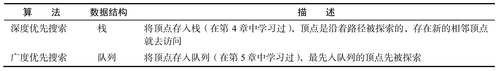
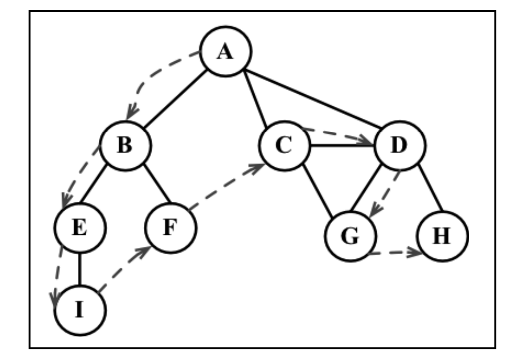

## 图

> 图是网状结构的抽象模型，图是一组由边连接的顶点

### 图的术语

- **相邻节点**

  由一条边连接在一起的顶点成为**`相邻节点`**

* 度

  一个顶点与值相连的顶点的个数

### 创建 Graph 类

```js
import Dictionary from './08-字典.js';

class Graph {
  //构造函数中传递一个参数表示是否为有向图
  constructor(isDirected = false) {
    this.isDirected = isDirected;
    // 创建一个数组存储顶点
    this.virtices = [];
    // 使用字典来存储顶点之间的关系，key 为顶点，value 为与其相连的顶点列表
    this.adjList = new Dictionary();
  }

  addVertex(v, w) {
    if (!this.virtices.includes(v)) {
      this.virtices.push(v);
      this.adjList.add(v, []);
    }
  }
  addEdge(v, w) {
    if (!this.adjList.get(v)) {
      this.virtices.push(v);
    }
    if (!this.adjList.get(w)) {
      this.virtices.push(w);
    }
    this.adjList.get(v).push(w);
    // 非有向图时添加 w -> v 的边
    if (!this.isDirected) {
      this.adjList.get(w).push(v);
    }
  }

  // 获取顶点
  getVertices() {
    return this.virtices;
  }
  // 获取邻接表
  getAdjList() {
    return this.adjList;
  }
}
```

### 图的遍历

> 图遍历可以用来寻找特定的顶点或者寻找两个顶点之间的路径，检查图是否连通，是否存在环
> 

#### 广度优先搜索

广度优先搜索会会从指定的顶点开始遍历图，先访问其所有的邻点。

- 创建一个队列 Q
- 标注 v 为被访问过的。并添加到队列 Q
- 如果 Q 非空,执行以下步骤
  - 在队列中取出 u
  - 标注 u 为被访问过
  - 将 与 u 相邻为访问过的顶点加入队列

广度优先搜索可以想成逐层遍历一个树

```js
Graph.prototype.BFS = function (startVertex) {
  // 使用数组模拟队列
  let queue = [],
    // 创建数组标记顶点是否被访问过，所有的顶点都没有访问过

    mask = new Array(this.virtices.length).fill(0);

  queue.push(startVertex);
  while (queue.length) {
    let u = queue.shift();
    // 标记为访问过
    mask[u] = 1;
    // 获取与其相邻的顶点
    const neighbors = this.adjList.get(u);
    for (let i = 0; i < neighbors.length; i++) {
      if (!mask[neighbors[i]]) {
        queue.push(neighbors[i]);
      }
    }
    // 打印被访问的顶点
    console.log(u);
  }
};
```

##### 使用广度优先搜索获取最短路径

```js
// 使用广度优先搜索获取最短路径
Graph.prototype.BFS = function (startVertex) {
  let queue = [],
    mask = new Array(this.virtices.length).fill(0),
    // 创建一个对象存储每个顶点到其实顶点的最短距离
    distance = {},
    // 存储顶点的前驱顶点
    predecessors = {};

  // 出是化
  for (let i = 0; i < this.virtices.length; i++) {
    distance[this.virtices[i]] = 0;
    predecessors[this.virtices[i]] = null;
  }

  queue.push(startVertex);
  while (queue.length) {
    let u = queue.shift();
    mask[u] = 1;
    const neighbors = this.adjList.get(u);
    for (let i = 0; i < neighbors.length; i++) {
      if (!mask[neighbors[i]]) {
        // 顶点到其实顶点的距离等于 前驱顶点的距离加一
        distance[neighbors[i]] = distance[u] + 1;
        predecessors[neighbors[i]] = u;
        queue.push(neighbors[i]);
      }
    }
  }

  return {
    distance,
    predecessors,
  };
};
```

#### 深度优先搜索



```js
Graph.prototype.DFS = function () {
  let queue = [],
    _this = this;
  // 获取所有顶点
  let vertices = this.getVertices(),
    // 声明标记数组
    mask = [];
  // 遍历所有节点
  for (let i = 0; i < vertices.length; i++) {
    // 如果节点没有被访问过，从该节点开始进行深度优先搜索
    if (!mask[vertices[i]]) {
      deepSearch(vertices[i]);
    }
  }
  // deepSearch('A');
  console.log(queue);
  // 辅助函数
  function deepSearch(u) {
    queue.push(u);
    // console.log(u);
    mask[u] = 1;
    let neighbors = _this.adjList.get(u);
    // console.log(u);
    // console.log(neighbors);
    for (let i = 0; i < neighbors.length; i++) {
      if (!mask[neighbors[i]]) {
        mask[neighbors[i]] = 1;
        arguments.callee(neighbors[i]);
      }
    }
  }
};
```

#### 最短路径算法

#### Dijkstra 算法

> `Dijkstra算法` 是一计算从单个源到其他所有源的最短路径的贪心算法
