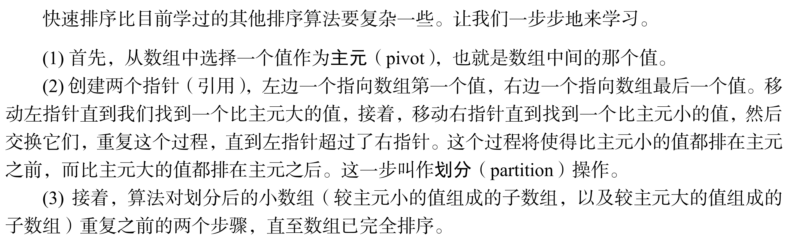
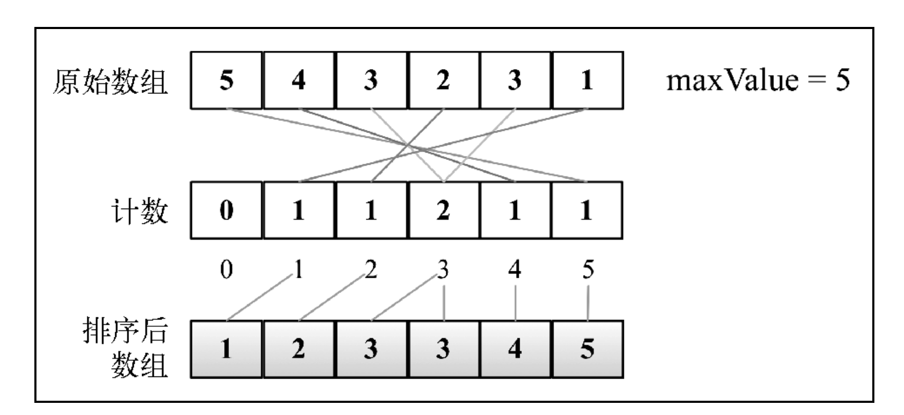

## 排序

### 冒泡排序

> 冒泡排序比较所有相邻的两个项，如果第一个比第二个大，则交换它们。元素项向上移动至正确的顺序，就好像气泡升至表面一样，冒泡排序因此得名

```js
/**
 * 冒泡排序
 *
 * @param {*} array
 */
function bubbleSort(array) {
  const { length } = array;
  for (let i = 0; i < length; i++) {
    for (let j = 0; j < length - i - 1; j++) {
      if (array[j] > array[j + 1]) {
        [array[j], array[j + 1]] = [array[j + 1], array[j]];
      }
    }
  }
  return array;
}

/**
 * 优化冒泡排序 1
 * 设置一个变量记录是否发生了数据交换，
 * 若内层循环没有发生交换，则便是整个数组有序，结束函数运行
 *
 */

function bubbleSort1(params) {
  const { length } = array;
  for (let i = 0; i < length; i++) {
    let isSort = true;
    for (let j = 0; j < length - i - 1; j++) {
      if (array[j] > array[j + 1]) {
        isSort = false;
        [(array[j], array[j + 1])] = [array[j + 1], array[j]];
      }
    }
    if (isSort) {
      return array;
    }
  }
  return array;
}

/**
 * 优化冒泡排序 2
 *
 * 使用一个变量来记录内循环中最后一次发生数据交换的位置，
 * 在此位置之后的所有元素都是已经有序的，
 * 不再进行循环
 */
function bubbleSort2(params) {
  const { length } = array;
  let endPos = 0;
  for (let i = 0; i < length; i++) {
    let isSort = true;
    for (let j = 0; j < endPos; j++) {
      if (array[j] > array[j + 1]) {
        isSort = false;
        endPos = j;
        [(array[j], array[j + 1])] = [array[j + 1], array[j]];
      }
    }
    if (isSort) {
      return array;
    }
  }
  return array;
}
```

### 选择排序

> 选择排序是一种原址排序，基本思想就是找出数据结构中最小的值放在第一位，然后找出第二小的值，放在第二位，以此类推

```js
/**
 * 找出最小值放在第一位
 *
 * @param {*} params
 */
function selectSort(params) {
  const { length } = params;
  let minIndex;
  for (let i = 0; i < length - 1; i++) {
    // 找出剩余元素中的最小值
    for (let j = i; j < length; j++) {
      if (array[minIndex] < array[j]) {
        minIndex = j;
      }
    }
    [array[minIndex], array[i]] = [array[i], array[minIndex]];
  }
  return array;
}
```

### 插入排序

> 插入排序每次只对一个元素进行排序，将其插入到已经有序的序列中

```js
/**
 * 插入排序
 *
 * @param {*} array
 */
function insertSort(array) {
  const { length } = array;
  let temp;
  for (let i = 0; i < length; i++) {
    let j = i;
    temp = array[i];
    // 将元素插入到合适的位置
    while (j >= 0 && array[j - 1] > temp) {
      array[j] = array[j - 1];
      j--;
    }
    array[j] = temp;
  }
  return array;
}
```

### 归并排序

> 归并排序是一种分而治之的算法。其思想是将一个数组分成多个较小的数组，直到每个数组只有一个元素，接着将小数组合并成较大的数组，直到只剩一个有序的数组

**归并排序的事件复杂度：`O(nlogn)`**

```js
/**
 *  归并排序主函数
 *
 * 将源数组拆分成较小的数组，并调用用来排序的函数
 */

function margeSort(array) {
  if (array.length > 1) {
    const minddle = Math.floor(array.length / 2);
    const left = margeSort(array.slice(0, minddle));
    const right = margeSort(array.slice(minddle, array.length));

    marge(left, right);
  }
  return array;
}

/**
 * 归并排序：对数组进行排序和合并的函数
 */

function marge(left, right) {
  let i = (j = 0);
  const result = [];
  while (i < left.length && j < right.length) {
    if (left[i] < right[j]) {
      result.push(left[i]);
      i++;
    } else {
      result.push(right[j]);
      j++;
    }
  }
  while (i < left.length) {
    result.push(left[i]);
    i++;
  }
  while (j < right.length) {
    result.push(right[j]);
    j++;
  }
  return result;
}
```

### 快速排序

> 快速排序也许是最常用的排序算法了。它的复杂度为 O(nlog(n))，且性能通常比其他复杂度为 O(nlog(n))的排序算法要好。和归并排序一样，快排序也使用分而治之的方法，将原始数组分为较小的数组（但它没有像归并排序那样将它们分割开）



```js
var quickSort = function (arr) {
  if (arr.length <= 1) {
    return arr;
  }
  var pivotIndex = Math.floor(arr.length / 2);
  var pivot = arr.splice(pivotIndex, 1)[0];
  var left = [];
  var right = [];
  for (var i = 0; i < arr.length; i++) {
    if (arr[i] < pivot) {
      left.push(arr[i]);
    } else {
      right.push(arr[i]);
    }
  }
  return quickSort(left).concat([pivot], quickSort(right));
};
```

### 计数排序 ---- 分布式排序

> 计数排序使用一个临时数组来记录每个数出现的次数，迭代临时数组来获取排序后的结果数组



```js
function countingSort(array) {
  if (array.length < 2) {
    return array;
  }

  // 获取待排序数组中的最大值，并创建临时数组，临时数组大小为待排序数组的最大值加一（数组索引从零开始）
  let maxValue = Math.max(...array);
  let count = new Array(maxValue + 1);

  for (let i = 0; i < array.length; i++) {
    if (!count[array[i]]) {
      count[array[i]] = 0;
    }
    count[array[i]]++;
  }
  let sortedIndex = 0;

  count.forEach((count, i) => {
    while (count > 0) {
      array[sortedIndex++] = i;
      count--;
    }
  });
  return array;
}
```

### 桶排序 --- 分布式排序

> 桶排序，将元素放入不同的桶中，在使用一个简单的排序算法来对每个桶中元素进行排序，然后在将所有的桶合并得到有序的数组

```js
/**
 *
 * 桶排序
 *
 *
 * @param {*}} params
 */
function bucketSort(array) {
  if (array.length < 2) {
    return array;
  }
  const buckets = createBuckets(array, 5);
  return sortBuckets(buckets);
}

/**
 * 桶排序辅助函数
 *
 *  创建桶并将元素放入桶中
 * @param {*} params
 */
function createBuckets(array, bucketSize) {
  let minValue = array[0];
  let maxValue = array[0];
  for (let i = 1; i < array.length; i++) {
    // {4}
    if (array[i] < minValue) {
      minValue = array[i];
    } else if (array[i] > maxValue) {
      maxValue = array[i];
    }
  }
  const bucketCount = Math.floor((maxValue - minValue) / bucketSize) + 1; // {5}
  const buckets = [];
  for (let i = 0; i < bucketCount; i++) {
    // {6}
    buckets[i] = [];
  }
  for (let i = 0; i < array.length; i++) {
    // {7}
    const bucketIndex = Math.floor((array[i] - minValue) / bucketSize); // {8}
    buckets[bucketIndex].push(array[i]);
  }
  return buckets;
}
/**
 * 桶排序辅助函数
 *
 * 对每一个桶中的元素进行排序并合并成一个有序的数组
 * @param {*} buckets
 */
function sortBuckets(buckets) {
  const sortedArray = []; // {9}
  for (let i = 0; i < buckets.length; i++) {
    // {10}
    if (buckets[i] != null) {
      insertSort(buckets[i]); // {11}
      sortedArray.push(...buckets[i]); // {12}
    }
  }
  return sortedArray;
}
```
