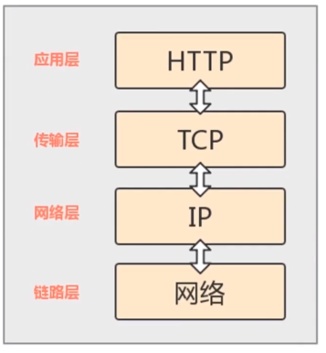

## 浏览器工作原理

### 浏览器工作过程

### HTTP

- **超文本传输协议（HTTP）是一种通信协议，他允许将超文本标记语言（HTMP）文档从 Web 服务器传送到客户端的浏览器**

- HTTP 是一个属于应用层的面向对象的协议，由于其简捷、快速的方式，使用与分布式超媒体信息系统。于 1990 年提出

## 透过 TCP/IP 看 HTTTP

- HTTP 协议是构建在 TCP/IP 协议之上，是 tcp/ip 协议的一个子集

### TCP/IP 协议族分层

tcp/ip 协议组是由一个四层协议组成的系统，分别为 `应用层`、`传输层`、`网络层`、`数据链路层`

- 应用层协议： FTP 、DNS、HTTP
- 传输层协议：TCP（面向连接）、UDP（面向五连接）
