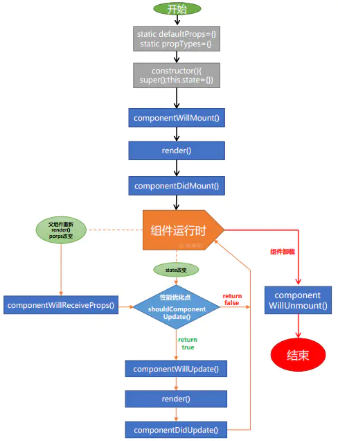

## 安装 react 和 react-dom

`npm install react react-dom -S`

## 创建虚拟 dom 并渲染到页面上

```javascript
/**
 * 创建虚拟 dom
 *
 * 参数1：创建元素的类型，字符串类型数据，表示元素的名称（标签名）
 * 参数2：是一个对象或 null，表示这个 DOM 元素的属性
 * 参数3：子节点（包括其他 虚拟 DOM  文本子节点）
 * 参数3以后的参数都是表示自节点
 */
const myh1 = React.createElement('h1', null, '这是一个h1');

/**
 * 使用 react-dom 将虚拟dom 渲染到页面上
 *
 * 参数1：需要渲染的 dom 元素变量
 * 参数2：指定页面上的一个元素容器
 */

ReactDOM.render(myh1, document.getElementById('app'));
```

## 使用 jsx 语法

jsx 语法的本质还是在运行的时候转换成 React.createElement 的形式来执行，需要使用 `babel` 来进行转换

## 组件 & Props

### 函数组件（使用 javascript 函数的方法创建组件）

```jsx
/**  定义一个函数组件
 * 组件名称遵循驼峰规则
 */
function Helloworld(props) {
  return <div>hello {propps.name}</div>;
}

/**
 * react 元素可以是用户自定义的组件
 * 因此将组件当成一个元素进行渲染
 */

const el = <Helloworld name='world' />;

ReactDOM.render(el, document.getElementById('app'));
```

### class 组件

```jsx
class Welcome extends React.Component {
  constructor() {
    //  在自定义的构造器中，必须调用 super()，才可以使用 this
    super();

    // this.state={}   相当于 Vue 中 的 this.data
    this.state = {};
  }
  render() {
    return <div>hello {this.props.name}</div>;
  }
}

const wel = <Welcome name='react' />;

ReactDOM.render(wel, document.getElementById('app'));
```

**使用 function 创建的组件没有自己的生命周期和私有数据，只有 props,props 中数据是只读的**

- 用**构造函数**创建的组件叫做 **无状态组件**
- 用**class 关键字**创建的组件叫做 **有状态组件**

  **有状态组件和无状态组件的本质区别就是：有无 state 属性和有无生命周期函数，this.state 中的数据是可读可写**

## react 中的样式作用域问题

在 react 中的样式文件默认是全局生效的，在 webpack 中配置使其模块化

```
{test:/\.css$/,use:['style-loader','css-loader?modules']}
```

在组件中导入 css 样式表作为一个对象，将对象属性最为类名绑定到元素中

## 组件中的 state

`react` 组件中的 `state` 属性相当于 `Vue` 中 的 `data` 属性，定义了该组件的数据变量，该属性需要写在组件的构造函数中

```jsx
class Helloworld extends React.Component {
  constructor() {
    super();
    this.state = {
      msg: 'data',
    };
  }
  render() {
    return (
      <div>
        hello {this.props.name} <h2>{this.state.msg}</h2>
      </div>
    );
  }
}
```

在 `react` 中不能直接修改 `state` 中的值，因为这样不会重新渲染组件，在修改 `state` 中值时，需要使用 `setState()` 方法

```jsx
this.setState({ msg: '这是修改之后的数据' });
```

若在更新数据，需要使用到一个异步数据时，需要让 setState 接受一个函数而不是一个对象

```jsx
this.setState((state, props) => {
  msg: state.msg + props.name;
});
```

## 组件的生命周期函数



- **`componentWillMount()`**
  > 组件将被渲染到页面之前触发，此时页面没有 DOM 元素，不能进行 DOM 操作。此时可以开启定时器、请求数据等操作。

* **`render()`**
  > 组件渲染

- **`componentDidMount()`**
  > 组件被渲染到页面后触发，此时可以进行 DOM 操作

* **`componentWillReceiveProps()`**
  > 组件接受到属性时触发

- **`shouldComponentUpdate()`**
  > 当组件接受到新属性时，或者组件状态发生改变是触发，首次渲染组件是并不会触发

* **`componentWillUpdate()`**
  > 组件即将被更新前触发

- **`componentDidUpdate()`**
  > 组件更新完成后触发

* **`componentWillUnmount()`**
  > 组件被销毁是触发

## 事件处理
